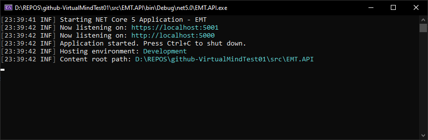

# VirtualMind Test Project

The project covers the following:

Backend Project
- A solution with different layers and projects (API, Business logic, Data Access Layer and Common).
- Global exception handler in Startup.cs
- Logging capabilities with Serilog (Console and File).
- Flexible configuration in Appsetings.json
- API layer with controller using different routing for each process and http status codes.
- Descriptive API endpoints with Swagger.
- Business Logic Layer with object-oriented design.
- Data access with Entity Framework Core and SQL Server.
- HttpClient with best practices to avoid memory leaking.

Frontend Project
- Developed with Angular 12.
- Using HttpClient with Service to fetch data from Backend WebApi.
- Quote and Purchase features implemented.

**Technologies used**: Angular 12, ASP.Net Core WebApi 5, Entity Framework Core, SQL Server 2019.

## Database creation

In order to use this demo, create a local SQL Server database (SQLExpress or better) with the name **VirtualMindTest**. Then, create this table:

```sql
USE [VirtualMindTest]
GO
/****** Object:  Table [Purchase]    Script Date: 5/31/2021 11:36:12 PM ******/
SET ANSI_NULLS ON
GO
SET QUOTED_IDENTIFIER ON
GO
CREATE TABLE [Purchase](
	[PurchaseId] [int] IDENTITY(1,1) NOT NULL,
	[UserId] [int] NOT NULL,
	[AmmountARS] [decimal](8, 2) NOT NULL,
	[IsoCurrencyCode] [varchar](3) NOT NULL,
	[PurchaseAmmount] [decimal](8, 2) NOT NULL,
	[PurchaseDateTime] [datetime] NOT NULL,
 CONSTRAINT [PK_Purchases] PRIMARY KEY CLUSTERED 
(
	[PurchaseId] ASC
)WITH (PAD_INDEX = OFF, STATISTICS_NORECOMPUTE = OFF, IGNORE_DUP_KEY = OFF, ALLOW_ROW_LOCKS = ON, ALLOW_PAGE_LOCKS = ON) ON [PRIMARY]
) ON [PRIMARY]
GO
```

## Appsetings.json Configuration

- Update the connection string **"cs01"** in **appsetings.json** file. Target to your local database and set the user and password required.
- Update the logging parameters if required. By default the application logs to Console and File (generated in logs folder).
- In the MyAppConfig section, specify the parameters / configuration for each endpoint that provides exchange data to the application and the maximum purchase per month/user.

```json
{
  "Serilog": {
    "Using": [ "Serilog.Sinks.Console", "Serilog.Sinks.File", "Serilog.Enrichers.ClientInfo" ],
    "MinimumLevel": "Information",
    "Enrich": [ "WithClientIp", "WithClientAgent", "FromLogContext", "WithMachineName", "WithThreadId" ],
    "WriteTo": [
      {
        "Name": "Console",
        "Args": {
          "restrictedToMinimumLevel": "Information" // Filter
        }
      },
      {
        "Name": "File",
        "Args": {
          "restrictedToMinimumLevel": "Information", // Filter
          "path": "./logs/log_.log",
          "formatter": "Serilog.Formatting.Compact.CompactJsonFormatter, Serilog.Formatting.Compact",
          "rollingInterval": "Day",
          "retainedFileCountLimit": 30
        }
      }
    ],
    "Properties": {
      "Application": "VirtualMindTest"
    }
  },
  "AllowedHosts": "*",
  "MyAppConfig": {
    "ExchangeToARS": {
      "USD": {
        "Url": "https://www.bancoprovincia.com.ar/Principal/Dolar",
        "MaxPurchasePerMonth": 200
      },
      "BRL": {
        "Url": "",
        "MaxPurchasePerMonth": 300
      }
    }
  },
  "ConnectionStrings": {
    "cs01": "Data Source=.\\SQLSERVER;Initial Catalog=VirtualMindTest;User ID=sa;Password=Passw0rd;"
  }
}

```

## Run and execute the WebApi

Compile the solution and RUN the EMT.API project in Visual Studio:


## Run and execute the FrontEnd app

1. Install all the node packages: npm install
2. Run the angular application (at http://localhost:4200/quote): npm start

## Endpoints and URLs
The WebApi has two endpoints and swagger endpoint:

1. Endpoint for retrieving exchange rate.
   
   Url (GET): https://localhost:5001/api/ExchangeRate/getexchangetoars/USD
   (You can use USD or BRL)

2. Endpoint for making a purchase/exchange
   
   Url (POST): https://localhost:5001/api/ExchangeRate/purchase
   
   body:
   
   ```json
   {
   "UserId": 17,
   "AmmountARS": 5000,
   "IsoCurrencyCode": "BRL"
   } 
   ```
3. Swagger endpoint: https://localhost:5001/swagger/index.html

The Frontend (Angular) project can be accessed at :

1. Url for retrieving exchange rates:
   http://localhost:4200/quote
2. Url to perform a purchase: 
   http://localhost:4200/purchase

## Project requirements
Create a web app API using .NET to expose two endpoints:

1) The first one will retrieve the exchange rate from that day for a given currency, where the
   currency ISO Code will be the input endpoint. Only the American dollar (USD) and Brazilian
   real (BRL) currencies will be taken as valid. If the exchange currency entered is different than
   those, an appropriate error message should appear.
   The dollar exchange rate will be retrieved from the following external service:
   http://www.bancoprovincia.com.ar/Principal/Dolar
   The real (currency) exchange rate will be a quarter of the dollar exchange rate.
   Take into account that in future versions the real (currency) exchange rate will be retrieved
   from another external service which is being developed by a third-party team. In the
   foreseeable future, we intend to incorporate to our API another currency, the Canadian
   dollar.
2) The second one will make a currency purchase. Given a user ID, an amount to
   exchange/purchase in Argentinian pesos, and a currency code, the endpoint will create a
   transaction that will be stored in the database, as well as the user information and the
   amount purchased, in the selected currency. For example, for an amount of 1000 and a
   currency “dollar”, the purchase will be stored in the database with a return/resulting value of
   1000/{dollar currency exchange rate} dollars.
   The amount entered will be validated. For the dollar, the limit is USD 200. For the real, the
   limit is BRL 300. All limits — beyond which the user will not be able to use the app — will be
   set in the foreign currency, per user, and per month. If the exchange currency entered is a
   different one, an appropriate error message should appear.
   For the database, keep the design as simple as possible. Assume that the users exist, and that
   no validations will be applied to them. Only validate the monthly purchases (transactions) by
   the user. Include the database scripts you may need, such as those for database and tables
   creation.
   About the endpoints created above, we would like to know what do you think about using the
   user ID as the input endpoint. Also, how would you improve the transaction to ensure that the
   user who makes the purchase is the correct user?
   We will value:
   ● That the web API is written in NET Core.
   ● Service-oriented development.
   ● Best practices for endpoint development (HTTP verbs and status codes, routes, etc.)
   ● Good handling of exceptions
   ● Object-oriented development
   ● Writing unit tests for services
   ● Errors log

Angular (optional)
Create a very simple app in Angular 2+ with two routes:
a) /quote will show the exchange rate of the dollar and real currencies by using the API
developed in the previous step. Add a button for refreshing the exchange rates.
b) /purchase will list the same exchange rates on a) and a mini purchase form consisting
of three text fields (user ID, currency, amount to purchase in pesos) and a button to
create the transaction through our API. It will also show the result of the transaction.
● Display a loading wheel while the transaction is in progress.
● We will value the implementation of NgRx, Application State Management, within the app.
